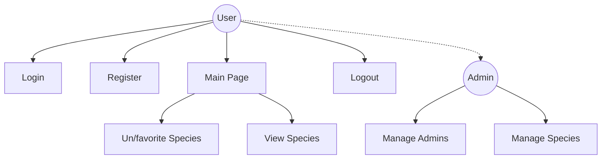
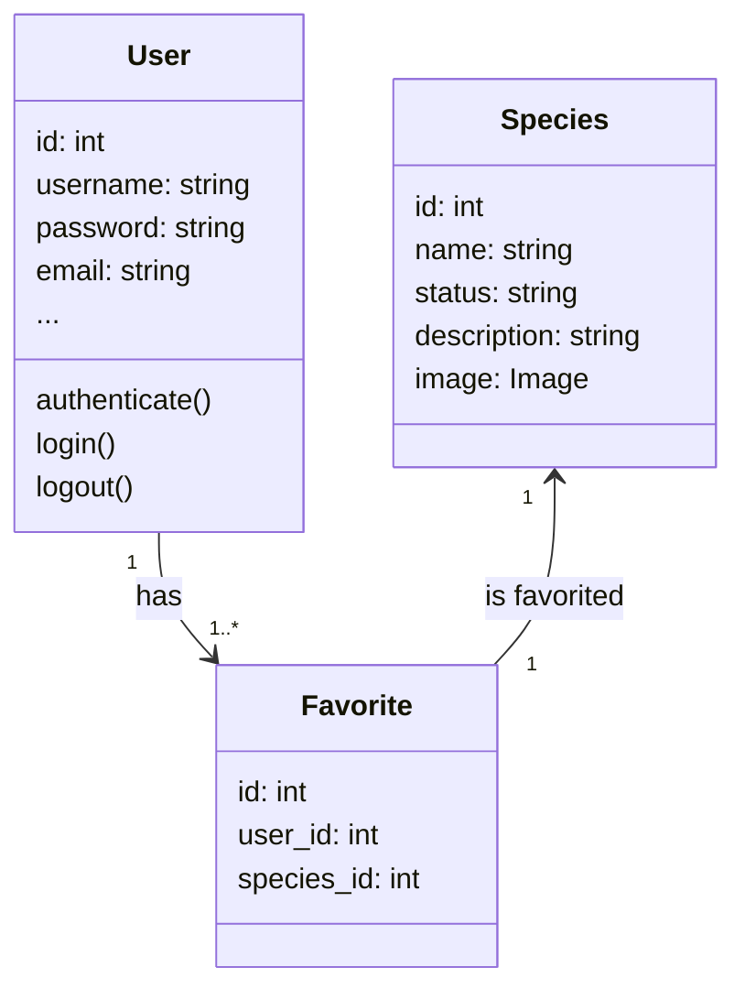
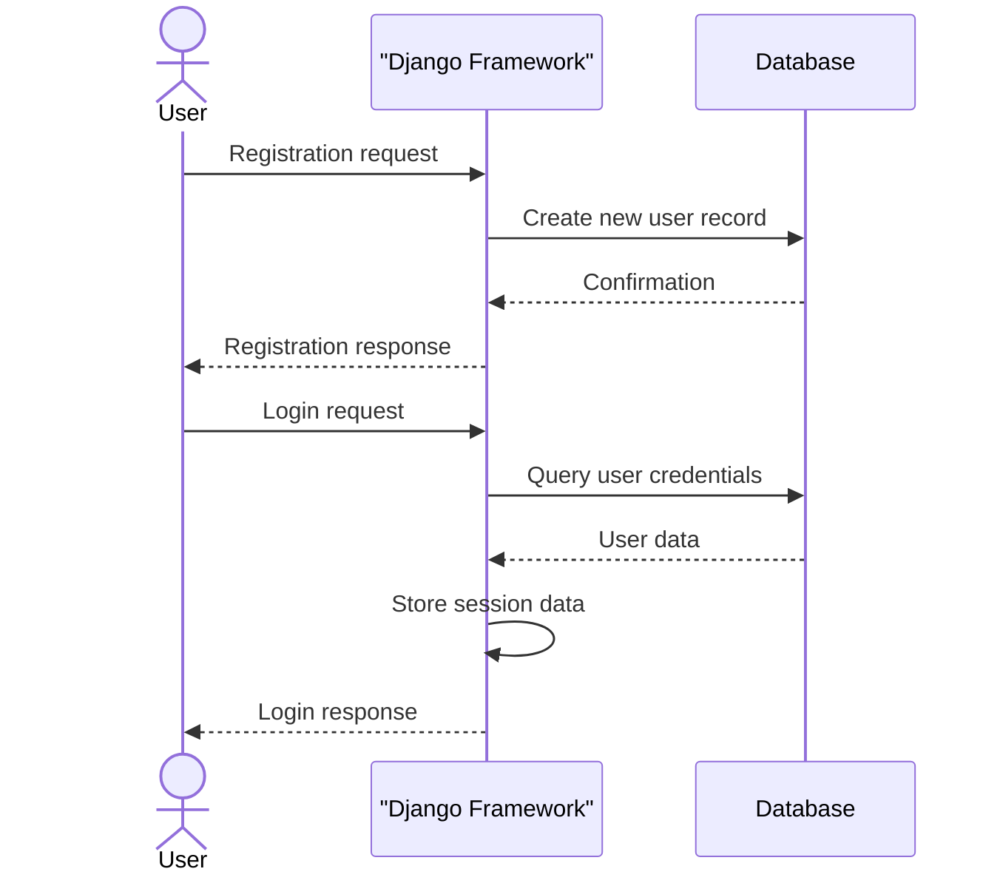
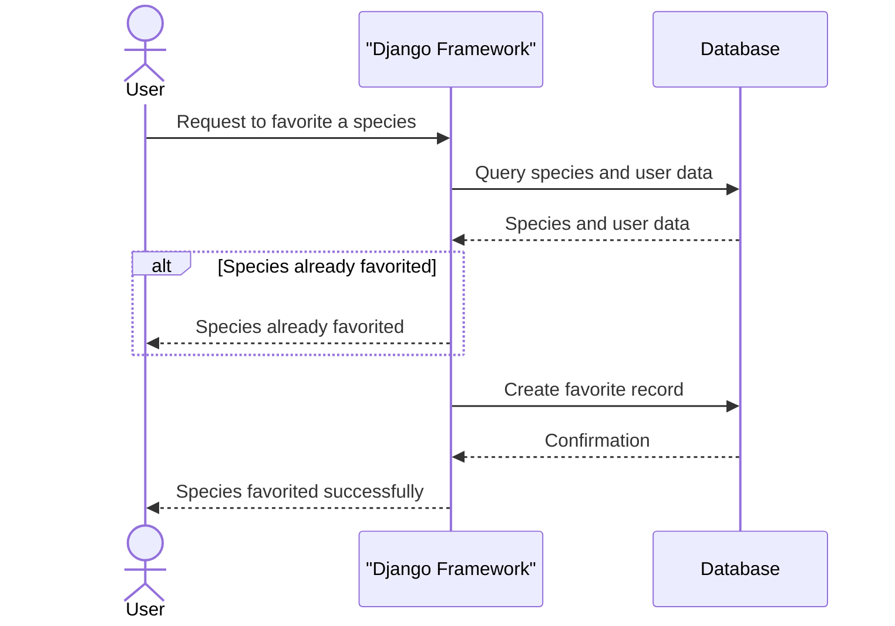

```mermaid
graph TD;
    A((User)) --> B[Login]
    A --> C[Register]
    A --> D[Main Page]
    D --> E[Un/favorite Species]
    D --> Z[View Species]
    A --> F[Logout]
    G((Admin)) -->H[Manage Admins]
    A -.->
    G --> I[Manage Species]

```

```mermaid
classDiagram
    class User {
        id: int
        username: string
        password: string
        email: string
        ...
        authenticate()
        login()
        logout()
    }

    class Species {
        id: int
        name: string
        status: string
        description: string
        image: Image
    }

    class Favorite {
        id: int
        user_id: int
        species_id: int
    }

    User "1" --> "1..*" Favorite : has
    Species "1" <-- "1" Favorite : is favorited

```

``` mermaid
sequenceDiagram
    actor User
    participant Django as "Django Framework"
    participant Database

    User->>Django: Registration request
    Django->>Database: Create new user record
    Database-->>Django: Confirmation
    Django-->>User: Registration response

    User->>Django: Login request
    Django->>Database: Query user credentials
    Database-->>Django: User data
    Django->>Django: Store session data
    Django-->>User: Login response

```

```mermaid

sequenceDiagram
    actor User
    participant Django as "Django Framework"
    participant Database

    User->>Django: Request to favorite a species
    Django->>Database: Query species and user data
    Database-->>Django: Species and user data
    alt Species already favorited
        Django-->>User: Species already favorited
    end
    Django->>Database: Create favorite record
    Database-->>Django: Confirmation
    Django-->>User: Species favorited successfully
```